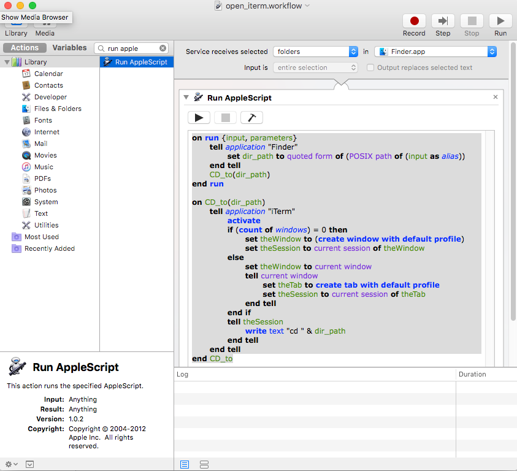
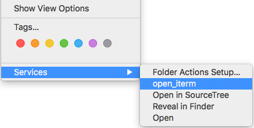

# How to open a folder from Finder in iTerm

1. Create a new Automator service: Automator -> New -> Service
2. Choose to Run AppleScript
3. Copy-paste script to the Window
4. Save as open_iterm and profit!
5. Now in Finder, right click a folder, and under Services there should be open_iterm.

(c) arkki @ 2016
